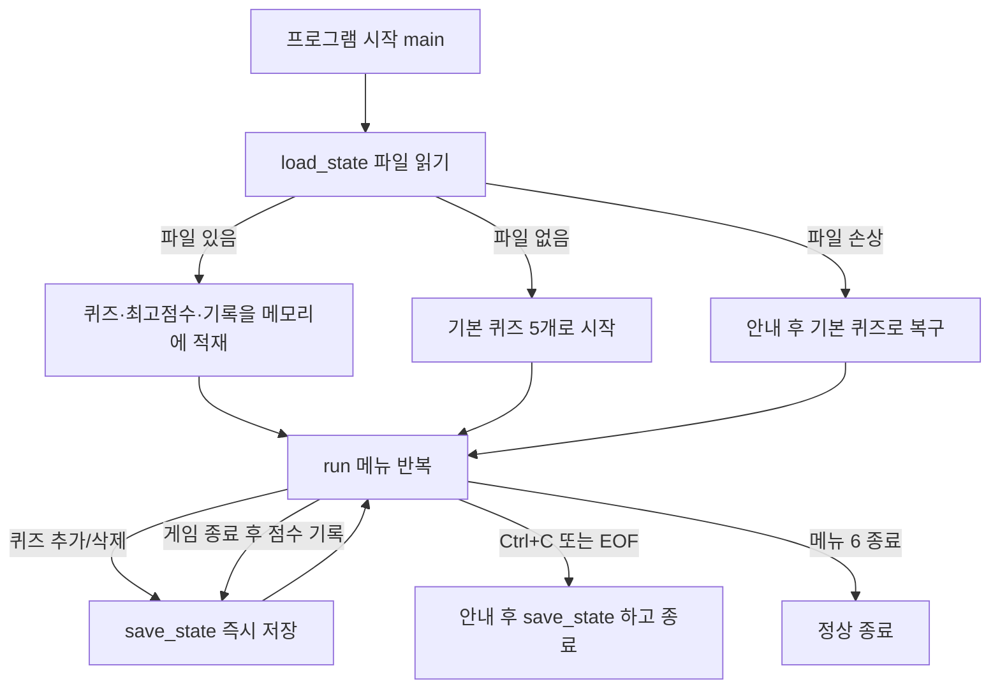

# 🎯 나만의 퀴즈 게임

터미널에서 동작하는 Python 콘솔 4지선다 퀴즈 게임입니다.

> **평가자용 안내** — 이 README는 `평가자가 확인하려는 것 → 구현 방법 → 그렇게 만든 이유 → 확인 방법`
> 순서로 작성했습니다. 3분 안에 핵심만 보시려면 아래 3개만 보셔도 됩니다.

| 바로가기 | 내용 |
| --- | --- |
| 📋 [**평가항목별 증거표**](#13-평가항목별-증거표) | 1-1 ~ 4-3 전 문항의 코드·Git·문서 증거를 **링크로 연결**한 표 |
| ▶️ [**최종 확인 방법**](#15-평가자용-최종-확인-방법) | 복사해서 붙이면 되는 검증 명령어 5분 코스 |

**원문 자료**: [`mission.txt`](mission.txt) (과제 요구사항) ·
[GitHub 저장소](https://github.com/ellysuh22/2-homework) · [커밋 이력](https://github.com/ellysuh22/2-homework/commits/main)

---

## 1. 이 과제는 무엇인가

**터미널에서 동작하는 파이썬 콘솔 퀴즈 게임을 처음부터 끝까지 직접 만들고,
그 과정을 Git으로 기록해 GitHub에 공개하는 과제**입니다. (원문: [`mission.txt`](mission.txt))

문법을 아는 것과 그 문법으로 프로그램 하나를 완성하는 것은 다른 경험이라는 점을 확인하는 것이 목적입니다.
그래서 평가도 "돌아가는가"만이 아니라 **"왜 그렇게 만들었는지 설명할 수 있는가"** 까지 봅니다.

과제가 요구하는 것은 크게 4가지이며, 이 프로젝트는 각각을 이렇게 만족합니다.

| 과제가 요구하는 것 | 이 프로젝트에서 |
| --- | --- |
| Python 기본 문법으로 입출력 흐름 만들기 | 메뉴 반복 → 입력 검증 → 기능 실행 ([main.py:321-339](main.py#L321-L339)) |
| 클래스(객체 지향)로 코드를 역할별로 구조화 | `Quiz`(문제 한 장) / `QuizGame`(게임 진행) 2개 클래스로 분리 |
| JSON 파일 저장으로 **데이터 영속성** 경험 | 종료 후 재실행해도 퀴즈·최고 점수 유지 (`state.json`) |
| Git으로 변경 이력 관리 | 커밋 30개 이상(게임 15 + 문서 15개 이상), 브랜치 생성 → 병합, GitHub 공개 |

> 💡 **데이터 영속성(persistence)** — 프로그램을 꺼도 데이터가 사라지지 않고 남아 있는 성질.
> 변수는 프로그램이 끝나면 사라지므로, 파일에 적어두어야 다음 실행 때 이어서 쓸 수 있습니다.

### 퀴즈 주제와 선정 이유

**주제: 파이썬 기초 문법**

이번 미션에서 직접 배우고 사용한 개념(리스트, 불린, 생성자 `__init__`, 딕셔너리, 반복문)을
그대로 문제로 만들었습니다. 게임을 만들면서 쓴 문법이 곧 문제가 되기 때문에,
**프로그램을 완성하는 과정 자체가 복습이 되도록** 주제를 골랐습니다.

기본 퀴즈 5개는 모두 직접 작성했으며, 코드에서는 [`default_quizzes()`](main.py#L74-L107)가
`Quiz` 클래스의 인스턴스로 만들어 돌려줍니다.

---

## 2. 실행 환경과 실행 방법

| 항목 | 값 |
| --- | --- |
| 언어 | Python 3.10 이상 (미션 요구 사항) |
| 검증에 사용한 버전 | Python 3.11.15 |
| 외부 라이브러리 | 없음 (표준 라이브러리만 사용) |
| 운영체제 | macOS에서 개발·검증 (Windows/Linux에서도 동작) |

```bash
git clone https://github.com/ellysuh22/2-homework.git
cd 2-homework
python3 main.py
```

> ⚠️ `python3 --version`이 3.10 미만으로 나오면 3.10 이상이 설치된 실행 파일을 직접 지정하세요.
> 예: `python3.11 main.py`

---

## 3. 기능 목적 — 무엇을 위해 만든 기능인가

프로그램을 실행하면 메뉴 6개가 나옵니다. 각 기능이 **어떤 목적으로 존재하는지**부터 정리하면 아래와 같습니다.
(상세 동작·검증 위치는 [5번 필수 기능 체크리스트](#5-필수-기능-체크리스트)에 있습니다.)

| 메뉴 | 기능 | 이 기능의 목적 |
| --- | --- | --- |
| 1 | 퀴즈 풀기 | 저장된 퀴즈를 랜덤 출제해 **정오답을 판정하고 점수를 계산**합니다. 프로그램의 핵심 흐름입니다. |
| 2 | 퀴즈 추가 | 사용자가 문제·선택지 4개·정답 번호를 직접 등록해 **데이터를 늘릴 수 있게** 합니다. |
| 3 | 퀴즈 목록 | 지금 어떤 문제가 저장돼 있는지 **눈으로 확인**하고, 삭제할 번호를 고를 수 있게 합니다. |
| 4 | 퀴즈 삭제 | 잘못 등록했거나 필요 없어진 문제를 **되돌릴 수 있게** 합니다. (보너스) |
| 5 | 점수 확인 | 최고 점수와 지난 기록을 보여줘 **재실행 후에도 데이터가 남아 있음을 증명**합니다. |
| 6 | 종료 | 저장된 상태를 유지한 채 프로그램을 **정상적으로 끝냅니다.** |

**전체 목적 한 줄 요약** — 메뉴 1~5는 `state.json`이라는 하나의 저장 파일을
**읽고(1·3·5) 바꾸는(2·4)** 동작이며, 그래서 프로그램을 껐다 켜도 내용이 그대로 남습니다.

- 점수 = `맞힌 문제 수 ÷ 푼 문제 수 × 100` (100점 만점, 반올림), 힌트 1회당 5점 차감, 최저 0점
- 잘못된 입력은 [`input_int()`](main.py#L166-L185) 한 곳에서 모두 걸러냅니다 → [6번 절](#잘못된-입력-처리--실제-출력-결과)

---

## 4. 파일 구조

```
2-homework/
├── main.py            # 프로그램 전체 (Quiz 클래스, QuizGame 클래스)
├── state.json         # 퀴즈·점수 저장 파일 (실행 중 자동 생성, .gitignore 대상)
├── README.md          # 프로젝트 설명 (이 문서)
├── .gitignore         # Git 추적 제외 목록
├── mission.txt        # 과제 요구사항 원문
└── docs/
    └── screenshots/   # 실행 화면 스크린샷
```

| 파일 | 역할 |
| --- | --- |
| `main.py` | 코드 전부. 클래스 2개(`Quiz`, `QuizGame`)와 실행 진입점 `main()`이 들어 있습니다. |
| `state.json` | 데이터 전부. 퀴즈 목록·최고 점수·게임 기록을 저장합니다. |
| `README.md` | 문서. 무엇을 왜 그렇게 만들었는지 설명합니다. |

**코드(`main.py`)와 데이터(`state.json`)를 나눈 것이 이 구조의 핵심**입니다.
코드는 바뀌지 않는 규칙, 데이터는 실행할 때마다 바뀌는 내용이라 파일부터 분리했습니다.

> **`state.json`을 `.gitignore`에 넣은 이유** — 실행하면서 계속 바뀌는 **개인 플레이 기록**이기 때문입니다.
> 코드가 아니라 데이터이므로 저장소에 올리지 않고, 첫 실행 시 기본 퀴즈 5개로 자동 생성되게 했습니다.
> 덕분에 저장소를 clone한 사람은 누구나 **동일한 기본 상태**에서 시작합니다.

### 코드 구조

- **`Quiz`** ([main.py:30-71](main.py#L30-L71)) — 퀴즈 한 문제
  - 속성: `question`, `choices`(4개), `answer`(1~4 번호), `hint`
  - 메서드: `display()`, `check()`, `to_dict()`, `from_dict()`
- **`QuizGame`** ([main.py:110-339](main.py#L110-L339)) — 게임 전체
  - 속성: `quizzes`, `best_score`, `history`
  - 메서드: `show_menu()` `run()` `play_quiz()` `ask_one()` `add_quiz()` `list_quizzes()`
    `delete_quiz()` `show_score()` `record_result()` `load_state()` `save_state()`
    `input_int()` `input_text()`

---

## 5. 필수 기능 체크리스트

미션의 **필수 요구 사항**입니다. 보너스 기능은 필수 항목을 대신하지 않으므로 아래에 따로 분리했습니다.

| 필수 요구 사항 | 상태 | 확인 위치 |
| --- | --- | --- |
| 메뉴 출력 + 기능 선택 + 종료 | ✅ 완료 | [`show_menu()`](main.py#L118-L130), [`run()`](main.py#L321-L339) |
| 퀴즈 풀기 (출제·정답 입력·정오답 안내·결과 표시) | ✅ 완료 | [`play_quiz()`](main.py#L261-L290), [`ask_one()`](main.py#L236-L259) |
| 퀴즈 추가 (문제·선택지 4개·정답 번호 입력 후 저장) | ✅ 완료 | [`add_quiz()`](main.py#L196-L208) |
| 퀴즈 목록 조회 | ✅ 완료 | [`list_quizzes()`](main.py#L210-L220) |
| 점수 확인 (최고 점수 비교·갱신·저장) | ✅ 완료 | [`show_score()`](main.py#L307-L319), [`record_result()`](main.py#L292-L305) |
| 퀴즈가 없는 경우 처리 | ✅ 완료 | [main.py:212-214](main.py#L212-L214), [main.py:263-265](main.py#L263-L265) |
| 아직 퀴즈를 풀지 않은 경우 처리 | ✅ 완료 | [main.py:309-311](main.py#L309-L311) |
| 클래스 2개 이상 정의 | ✅ 완료 | `Quiz`, `QuizGame` |
| 기능별 메서드 분리 | ✅ 완료 | 아래 [8번 항목](#8-입력-처리게임-진행저장을-분리한-기준) |
| 본인 주제 퀴즈 5개 이상 | ✅ 완료 | [`default_quizzes()`](main.py#L74-L107) — 5개 |
| 프로젝트 루트 `state.json`에 UTF-8로 저장/불러오기 | ✅ 완료 | [main.py:27](main.py#L27), [main.py:161](main.py#L161) |
| 재실행 시 퀴즈·최고 점수 유지 | ✅ 완료 | [`load_state()`](main.py#L132-L151) |
| 입력 검증 4종(공백/문자/범위 밖/빈 입력) | ✅ 완료 | [`input_int()`](main.py#L166-L185) |
| `Ctrl+C` / `EOF` 안전 종료 | ✅ 완료 | [`main()`](main.py#L342-L351) |
| 파일 없음 / 손상 시에도 실행 가능 | ✅ 완료 | [`load_state()`](main.py#L132-L151) |

### 보너스 기능 (선택 과제)

| 보너스 | 구현 | 위치 |
| --- | --- | --- |
| 랜덤 출제 | `random.sample()`로 매 판 순서를 섞음 | [main.py:271](main.py#L271) |
| 문제 수 선택 | 시작 전 몇 문제를 풀지 선택 | [main.py:269](main.py#L269) |
| 힌트 + 점수 차감 | 정답 입력창에서 `5` → 힌트, 1회당 5점 차감 | [main.py:241-251](main.py#L241-L251), [main.py:283](main.py#L283) |
| 퀴즈 삭제 | 번호로 삭제 후 파일 반영 | [`delete_quiz()`](main.py#L222-L234) |
| 점수 기록 히스토리 | 날짜/시간·푼 문제 수·정답 수·점수 저장 | [`record_result()`](main.py#L292-L305) |

---

## 6. 점수 계산과 잘못된 입력 처리

### 점수 계산

- 점수 = `맞힌 문제 수 ÷ 푼 문제 수 × 100` (100점 만점, 반올림)
- 힌트 1회당 5점 차감, 최저 0점 (`max(0, ...)`)
- 이전 최고 점수보다 높으면 갱신하고 파일에 저장

### 잘못된 입력 처리 — 실제 출력 결과

**입력값 검증(validation)** 은 "사용자가 넣은 값이 프로그램이 다룰 수 있는 값인지 미리 확인하는 것"입니다.
숫자를 받는 모든 곳은 [`input_int()`](main.py#L166-L185) 하나를 거치므로, 아래 4가지가 **전 메뉴에서 동일하게** 처리됩니다.

| 입력 | 처리 | 실제 출력 |
| --- | --- | --- |
| ` 1 ` (앞뒤 공백) | `.strip()`으로 공백 제거 후 정상 처리 | 정상 동작 |
| `abc` (숫자 아님) | 안내 후 재입력 | `⚠️ 숫자가 아닙니다. 1-6 사이의 숫자를 입력하세요.` |
| `0`, `9` (범위 밖) | 안내 후 재입력 | `⚠️ 잘못된 입력입니다. 1-6 사이의 숫자를 입력하세요.` |
| 빈 입력(그냥 Enter) | 안내 후 재입력 | `⚠️ 입력이 비어 있습니다. 1-6 사이의 숫자를 입력하세요.` |

문자를 받는 곳(문제·선택지 입력)은 [`input_text()`](main.py#L187-L194)가 빈 문자열을 막습니다.

---

## 7. `Quiz`와 `QuizGame`의 역할을 나눈 이유

> **클래스(class)** = 붕어빵 **틀**(설계도). **객체(instance)** = 그 틀로 찍어낸 붕어빵 하나.
> **속성(attribute)** = 객체가 *가진 정보*. **메서드(method)** = 객체가 *할 수 있는 행동*.
> **`__init__`** = 객체가 만들어질 때 자동 실행되어 속성을 채우는 생성자.
> **`self`** = "지금 이 객체 자신"을 가리키는 이름표. `self.question`은 *이 문제의* 질문이라는 뜻.

한 문장 요약: **`Quiz`는 "문제 카드 한 장", `QuizGame`은 "사회자"입니다.**

| | `Quiz` | `QuizGame` |
| --- | --- | --- |
| 비유 | 문제 카드 한 장 | 게임을 진행하는 사회자 |
| 아는 것 | 자기 문제·보기·정답·힌트만 | 카드 전부 + 점수 + 저장 파일 |
| 하는 일 | 자기를 출력(`display`), 자기 채점(`check`) | 메뉴 진행, 출제, 점수 계산, 저장/불러오기 |
| 모르는 것 | 점수 규칙, 메뉴, 파일 존재 자체 | 개별 문제의 내부 형식 |

**이렇게 나눈 이유 (역할과 책임 분리)** — **고쳐야 할 원인이 다르면 클래스도 따로 둔다**는 기준입니다.
문제의 생김새가 바뀌는 일(예: 선택지 4개 → 5개)과 게임 규칙이 바뀌는 일(예: 점수 계산 변경)은
서로 다른 사건입니다. 한 클래스에 다 넣었다면 점수 규칙만 고치려다 문제 출력이 깨질 수 있습니다.

**실제 효과** — `Quiz`가 자기 채점을 책임지므로, `QuizGame`은 정답이 몇 번인지 몰라도
`quiz.check(입력값)` 한 줄로 채점할 수 있습니다. 힌트 기능을 추가할 때도 `Quiz`에 속성 하나를
더하는 것으로 끝났습니다.

---

## 8. 입력 처리·게임 진행·저장을 분리한 기준

분리 기준은 **"고쳐야 할 원인이 다르면 코드도 따로 둔다"** 입니다.

| 묶음 | 담당 메서드 | 왜 따로 뺐나 |
| --- | --- | --- |
| **입력 처리(검증)** | [`input_int()`](main.py#L166-L185), [`input_text()`](main.py#L187-L194) | 메뉴·정답 번호·문제 수·삭제 번호·정답 입력 **5곳에서 같은 검증**이 필요. 한곳에 모아야 규칙이 바뀔 때 한 번만 고침 |
| **게임 진행** | [`play_quiz()`](main.py#L261-L290), [`ask_one()`](main.py#L236-L259), [`record_result()`](main.py#L292-L305) | 출제 규칙·점수 규칙이 바뀔 때만 수정되는 부분 |
| **데이터 저장/불러오기** | [`load_state()`](main.py#L132-L151), [`save_state()`](main.py#L153-L164) | 저장 방식(JSON → DB)이 바뀌어도 **여기 2개만** 고치면 되도록 격리 |
| **메뉴 흐름** | [`run()`](main.py#L321-L339) | 메뉴가 늘거나 줄 때만 수정 |

또한 `play_quiz()`(여러 문제 진행)와 `ask_one()`(한 문제 출제·채점)을 나눠,
"한 문제 흐름"과 "전체 판 흐름"을 각각 따로 읽고 고칠 수 있게 했습니다.

---

## 9. 실행부터 `state.json` 불러오기·저장까지의 흐름

**원칙: 읽기는 시작할 때 딱 1번, 쓰기는 데이터가 바뀔 때마다.**



| 시점 | 동작 | 코드 |
| --- | --- | --- |
| 프로그램 시작 | `load_state()` — 읽기 **1회** | [main.py:345](main.py#L345) |
| 실행 중 | 메모리(변수) 위에서만 작업 | — |
| 퀴즈 추가 직후 | `save_state()` | [main.py:207](main.py#L207) |
| 퀴즈 삭제 직후 | `save_state()` | [main.py:233](main.py#L233) |
| 한 판이 끝나 점수 기록 시 | `save_state()` | [main.py:304](main.py#L304) |
| `Ctrl+C` / `EOF` 발생 시 | 안내 후 `save_state()` | [main.py:348-351](main.py#L348-L351) |

**이렇게 한 이유** — 매 순간 파일을 읽으면 느리고, 끝에서 한 번만 저장하면 갑자기 꺼졌을 때 다 잃습니다.
**"한 번 읽고, 바뀔 때마다 즉시 적어둔다"** 가 속도와 안전의 균형점이라고 판단했습니다.

---

## 10. JSON을 선택한 이유와 데이터 구조

> **JSON** = 데이터를 `{"키": 값}` 형태로 적는 **텍스트 형식의 세계 표준 메모지**.
> **JSON 파싱(parsing)** = 그 텍스트를 프로그램이 다룰 수 있는 값(딕셔너리·리스트)으로 **해석해 옮기는 일**.
> 형식이 조금이라도 어긋나면 해석에 실패하고 `json.JSONDecodeError`가 납니다.

### 왜 JSON인가

| 이유 | 설명 |
| --- | --- |
| 사람이 읽을 수 있음 | 메모장으로 열어 내용을 눈으로 확인·수정 가능 (디버깅이 쉬움) |
| 파이썬 자료형과 모양이 같음 | dict ↔ object, list ↔ array가 1:1. `json.dump()` / `json.load()` 두 줄로 변환 |
| 표준 라이브러리로 충분 | 외부 라이브러리 금지 조건을 만족 |
| 확장성 | 나중에 웹·다른 언어로 그대로 주고받을 수 있음 |

한글이 `\uXXXX`로 깨져 저장되지 않도록 **UTF-8 인코딩 + `ensure_ascii=False`** 로 저장하고,
`indent=2`로 사람이 읽기 좋게 들여썼습니다. ([main.py:161-162](main.py#L161-L162))

### `state.json` 스키마

> **스키마(schema)** = 그 파일에 "어떤 이름의 칸이 어떤 타입으로 들어가는지" 정한 약속.

- **경로**: 프로젝트 루트 `./state.json` (`main.py`와 같은 위치로 고정 — [main.py:27](main.py#L27))
- **역할**: 퀴즈 목록·최고 점수·게임 기록을 저장해, 프로그램을 종료하고 다시 실행해도 그대로 유지되게 합니다.
- **인코딩**: UTF-8 (`ensure_ascii=False`로 한글을 그대로 저장)
- **생성 시점**: 첫 실행 때는 없으며, 퀴즈 추가·삭제 또는 한 판이 끝날 때 자동 생성

```json
{
  "quizzes": [
    {
      "question": "파이썬에서 리스트를 만들 때 사용하는 괄호는?",
      "choices": ["( )", "[ ]", "{ }", "< >"],
      "answer": 2,
      "hint": "순서가 있고 나중에 값을 바꿀 수 있는 자료형에 쓰는 기호입니다."
    }
  ],
  "best_score": 100,
  "history": [
    { "date": "2026-08-04 20:21", "total": 3, "correct": 3, "score": 100 }
  ]
}
```

| 필드 | 타입 | 설명 |
| --- | --- | --- |
| `quizzes` | list | 퀴즈 목록 (순서가 있고 개수가 변하므로 리스트) |
| `quizzes[].question` | str | 문제 |
| `quizzes[].choices` | list[str] | 선택지 4개 |
| `quizzes[].answer` | int | 정답 **번호** (1~4) |
| `quizzes[].hint` | str | 힌트 (없으면 빈 문자열) |
| `best_score` | int | 최고 점수 (0~100) |
| `history` | list | 게임 기록 (날짜/시간, 푼 문제 수, 정답 수, 점수) |

**이 구조로 설계한 이유**

1. `quizzes[]`의 필드 이름이 `Quiz` 클래스의 속성과 **1:1로 동일**합니다.
   그래서 [`to_dict()`](main.py#L54-L61) / [`from_dict()`](main.py#L63-L71)만으로 객체 ↔ 파일 변환이 끝나고,
   변환 과정에서 이름이 어긋나는 실수가 생기지 않습니다.
2. `answer`를 **글자가 아닌 번호(int)** 로 저장했습니다. 정답을 글자로 저장하면
   띄어쓰기 하나만 달라도 오답 처리되기 때문입니다.
3. `hint`는 `from_dict()`에서 `data.get("hint", "")`로 읽습니다.
   힌트 필드가 없는 옛날 형식의 파일도 **에러 없이 읽히도록** 한 하위 호환 장치입니다.
4. 저장 대상을 `quizzes` / `best_score` / `history` 3개의 최상위 칸으로 나눠,
   "문제 데이터"와 "플레이 결과"를 섞지 않았습니다.

---

## 11. 안전 종료와 파일 오류 처리

> **예외 처리 `try/except`** = "실패할 수 있는 일을 시도(`try`)하고, 실패하면(`except`)
> 프로그램을 죽이는 대신 미리 정한 대응을 하는" 안전망.
> **`KeyboardInterrupt`** = 사용자가 `Ctrl+C`로 강제 중단했을 때 발생.
> **`EOFError`** = 입력이 더 이상 없을 때(입력 스트림 종료) 발생.

### 안전 종료

`main()`에서 게임 루프 전체를 감쌌습니다. ([main.py:342-351](main.py#L342-L351))

```python
try:
    game.run()
except (KeyboardInterrupt, EOFError):
    print("\n\n⚠️ 입력이 중단되었습니다. 저장 후 안전하게 종료합니다.")
    game.save_state()
```

처리하지 않으면 빨간 오류 메시지(Traceback)와 함께 비정상 종료하고, 아직 저장되지 않은
상태가 사라질 수 있습니다. **문을 쾅 닫고 나가더라도 공책은 챙겨 나가도록** 만든 부분입니다.

### 파일 오류 처리

`load_state()`에서 아래 4가지 실패를 한 번에 잡습니다. ([main.py:144](main.py#L144))

| 잡는 예외 | 언제 생기나 | 대응 |
| --- | --- | --- |
| 파일 없음 (`os.path.exists` 사전 확인) | 첫 실행 | 기본 퀴즈 5개로 시작 |
| `json.JSONDecodeError` | 파일 내용이 깨짐 (수동 편집, 저장 중 강제 종료) | 안내 후 기본 퀴즈로 복구 |
| `KeyError`, `TypeError` | JSON은 멀쩡하지만 필요한 칸이 없음 | 안내 후 기본 퀴즈로 복구 |
| `OSError` | 권한 없음, 디스크 문제 | 읽기 실패 시 복구 / 쓰기 실패 시 안내 ([main.py:163-164](main.py#L163-L164)) |

**핵심 원칙**: "파일이 어떤 상태여도 게임은 반드시 실행된다."

---

## 12. Git 커밋·브랜치·병합·clone·pull 수행 내용

- **저장소**: https://github.com/ellysuh22/2-homework
- **커밋 수**: **30개 이상** — 게임 개발 15개 + 문서·자료 15개 이상 (요구 기준 10개 이상)
- **커밋 메시지 규칙**: `종류: 요약` — `Feat:` 새 기능 / `Fix:` 버그 수정 / `Docs:` 문서 / `Refactor:` 구조 정리 / `Chore:` 설정
- **커밋 단위**: **기능 하나 완성 = 커밋 1개**. 그래야 `git log`가 개발 일기가 되고,
  문제가 생겼을 때 그 기능이 들어온 커밋으로 되돌아가 원인을 좁힐 수 있습니다.

### 브랜치와 병합

> **브랜치(branch)** = 원본(`main`)을 그대로 둔 채 실험하는 **옆 책상**.
> **병합(merge)** = 옆 책상에서 완성한 결과를 원본에 합치는 것.

`퀴즈 풀기` 기능은 미션 요구대로 `feature/play-quiz` 브랜치에서 개발한 뒤 `main`에 병합했습니다.
만들다 실패해도 `main`은 항상 동작하는 상태로 남기기 위해서입니다.

```
$ git log --oneline --graph --all --decorate

*   2d45928 Merge: 퀴즈 풀기 기능을 main에 병합
|\
| * ec2775c (feature/play-quiz) Feat: 랜덤 출제, 문제 수 선택, 힌트 기능 추가 (보너스)
| * b432e80 Feat: 퀴즈 풀기 기능 구현
|/
* ff3840e Feat: state.json 저장/불러오기 구현
```

선이 갈라졌다가(`|\`) 다시 합쳐지는(`|/`) 부분이 **브랜치 생성과 병합의 기록**입니다.

**GitHub에서 바로 확인하기**

| 확인할 것 | 링크 |
| --- | --- |
| 병합 커밋 (부모가 2개인 것이 병합의 증거) | [`2d45928` Merge 커밋](https://github.com/ellysuh22/2-homework/commit/2d45928) |
| 브랜치에서 작업한 커밋 2개 | [`b432e80`](https://github.com/ellysuh22/2-homework/commit/b432e80) · [`ec2775c`](https://github.com/ellysuh22/2-homework/commit/ec2775c) |
| 갈라짐/합쳐짐 그래프 | [Network 그래프](https://github.com/ellysuh22/2-homework/network) |

### 전체 커밋 이력

커밋 **30개 이상**을 성격에 따라 둘로 나눴습니다. 전체 목록은 [GitHub 커밋 이력](https://github.com/ellysuh22/2-homework/commits/main)에서 볼 수 있습니다.

| 구분 | 개수 | 무엇 |
| --- | --- | --- |
| **① 게임 개발** | **15개** | `main.py`를 만든 커밋 — 아래 표 |
| **② 문서·자료** | **15개 이상** | 코드는 안 건드리고 설명 문서·캡처만 정리 |

#### ① 게임 개발 커밋 15개

| # | 커밋 (클릭 → GitHub) | 내용 | 관련 평가항목 |
| --- | --- | --- | --- |
| 1 | [`7234ac8`](https://github.com/ellysuh22/2-homework/commit/7234ac8) | Chore: 저장소 초기 설정 (.gitignore, README 뼈대 추가) | 1-5 |
| 2 | [`07d8931`](https://github.com/ellysuh22/2-homework/commit/07d8931) | Feat: 메뉴 화면 출력과 종료 기능 구현 | 1-1 |
| 3 | [`a79f908`](https://github.com/ellysuh22/2-homework/commit/a79f908) | Feat: 숫자 입력 공통 검증 로직(input_int) 추가 | 1-2, 2-2 |
| 4 | [`243592b`](https://github.com/ellysuh22/2-homework/commit/243592b) | Feat: Quiz 클래스 구현 | 2-1, 3-1 |
| 5 | [`8adca1c`](https://github.com/ellysuh22/2-homework/commit/8adca1c) | Feat: 파이썬 기초 주제 기본 퀴즈 5개 추가 | 1-4 |
| 6 | [`ff3840e`](https://github.com/ellysuh22/2-homework/commit/ff3840e) | Feat: state.json 저장/불러오기 구현 | 1-3, 2-3, 3-2 |
| 7 | [`b432e80`](https://github.com/ellysuh22/2-homework/commit/b432e80) | Feat: 퀴즈 풀기 기능 구현 *(feature/play-quiz)* | 1-1, 3-4 |
| 8 | [`ec2775c`](https://github.com/ellysuh22/2-homework/commit/ec2775c) | Feat: 랜덤 출제, 문제 수 선택, 힌트 기능 추가 *(feature/play-quiz)* | 보너스 |
| 9 | [`2d45928`](https://github.com/ellysuh22/2-homework/commit/2d45928) | **Merge: 퀴즈 풀기 기능을 main에 병합** | **1-6, 3-4** |
| 10 | [`6b1ba17`](https://github.com/ellysuh22/2-homework/commit/6b1ba17) | Feat: 퀴즈 추가 기능 구현 | 1-1 |
| 11 | [`49a4f0f`](https://github.com/ellysuh22/2-homework/commit/49a4f0f) | Feat: 퀴즈 목록 조회 기능 구현 | 1-1 |
| 12 | [`66a7da7`](https://github.com/ellysuh22/2-homework/commit/66a7da7) | Feat: 퀴즈 삭제 기능 구현 (보너스) | 보너스 |
| 13 | [`52fcfec`](https://github.com/ellysuh22/2-homework/commit/52fcfec) | Feat: 점수 확인과 게임 기록 히스토리 구현 (보너스 포함) | 1-1, 1-3 |
| 14 | [`c961ad8`](https://github.com/ellysuh22/2-homework/commit/c961ad8) | Fix: Ctrl+C와 입력 스트림 종료 시 안전하게 종료하도록 처리 | **2-4** |
| 15 | [`035cbde`](https://github.com/ellysuh22/2-homework/commit/035cbde) | Refactor: QuizGame 입력 처리 정리 및 불필요한 분기 제거 | 2-2, 2-5 |

#### ② 문서·자료 커밋 15개 이상

게임이 완성된 뒤, **평가자가 읽을 설명 자료**를 만든 커밋입니다. `main.py`의 동작은 바뀌지 않았습니다.

| 묶음 | 개수 | 대표 커밋 | 내용 |
| --- | --- | --- | --- |
| README 작성·정리 | 6 | [`6934ef3`](https://github.com/ellysuh22/2-homework/commit/6934ef3) · [`334e62f`](https://github.com/ellysuh22/2-homework/commit/334e62f) | 프로젝트 설명서 작성, 링크·커밋 수 정리 |
| 스크린샷 첨부 | 2 | [`af206ef`](https://github.com/ellysuh22/2-homework/commit/af206ef) · [`cd4e50e`](https://github.com/ellysuh22/2-homework/commit/cd4e50e) | 실행 화면 7장, 커밋 목록, clone/pull 터미널 |
| 평가 답변 노트 | 5 | [`52b64f6`](https://github.com/ellysuh22/2-homework/commit/52b64f6) · [`a5cbc96`](https://github.com/ellysuh22/2-homework/commit/a5cbc96) | `PASS_Answer.md` 작성 및 답변 순서 정리 |

> ⚠️ [`a5cbc96`](https://github.com/ellysuh22/2-homework/commit/a5cbc96) 는 문서 커밋이지만 `main.py`도 함께 바뀌었습니다.
> **주석만 추가**했고 실행 코드는 한 줄도 바뀌지 않았습니다.


### clone / pull 실습

미션 절차대로 다음을 수행했습니다.

1. 저장소를 별도 디렉터리에 `git clone`
2. clone한 쪽에서 README에 한 줄 추가 후 `commit` → `push`
3. 기존 작업 디렉터리에서 `git pull`로 변경사항 수신
4. 반영 확인

저장소에 남은 흔적은 커밋 [`3bf2517`](https://github.com/ellysuh22/2-homework/commit/3bf2517)
("Docs: clone 실습으로 README에 동기화 안내 문구 추가")과 이 문서 [맨 아래의 동기화 문구](#동기화-기록)입니다.

> 📸 터미널 캡처: [`clone_pull.png`](docs/screenshots/clone_pull.png)
> 프롬프트가 `test-clone %` 로 찍혀 있어, **clone한 폴더 안에서 실행했다는 것**까지 확인됩니다.

---

## 13. 평가항목별 증거표

과제 요구사항 원문은 [`mission.txt`](mission.txt)입니다.

`완료` = 코드·Git 기록으로 즉시 확인 가능 / `증거 추가 필요` = 구현은 되었으나 캡처 등 제출 증거가 부족

**표의 모든 파란 글씨는 링크입니다.** `코드 증거`는 `main.py`의 해당 줄로,
`Git·문서 증거`는 GitHub 커밋이나 이 README의 해당 절로 이동합니다.

### 항목 1 — 기능 동작 검증

| 평가번호 | 확인하려는 것 | 코드 증거 | Git·문서 증거 | 상태 |
| --- | --- | --- | --- | --- |
| **1-1** | 메뉴 및 4개 기능 동작 | [`run()`](main.py#L321-L339) · [`show_menu()`](main.py#L118-L130) | [기능 체크리스트](#5-필수-기능-체크리스트) · 커밋 [`07d8931`](https://github.com/ellysuh22/2-homework/commit/07d8931) | ✅ 완료 |
| **1-2** | 정오답 판정 + 입력 오류 4종 | [`input_int()`](main.py#L166-L185) · [`Quiz.check()`](main.py#L50-L52) | [잘못된 입력 처리](#잘못된-입력-처리--실제-출력-결과) · 커밋 [`a79f908`](https://github.com/ellysuh22/2-homework/commit/a79f908) | ✅ 완료 |
| **1-3** | 재실행 시 데이터 유지 | [`load_state()`](main.py#L132-L151) · [`save_state()`](main.py#L153-L164) | [저장 흐름](#9-실행부터-statejson-불러오기저장까지의-흐름) · 커밋 [`ff3840e`](https://github.com/ellysuh22/2-homework/commit/ff3840e) | ✅ 완료 |
| **1-4** | 기본 퀴즈 5개 이상 | [`default_quizzes()`](main.py#L74-L107) — 5개 | [주제 선정 이유](#퀴즈-주제와-선정-이유) · 커밋 [`8adca1c`](https://github.com/ellysuh22/2-homework/commit/8adca1c) | ✅ 완료 |
| **1-5** | GitHub 업로드 + 커밋 10개 이상 | — | [커밋 이력 30개 이상](https://github.com/ellysuh22/2-homework/commits/main) · [README 커밋표](#전체-커밋-이력) | ✅ 완료 |
| **1-6** | 브랜치·병합 기록 | — | [병합 커밋 `2d45928`](https://github.com/ellysuh22/2-homework/commit/2d45928) · [Network 그래프](https://github.com/ellysuh22/2-homework/network) · [README 브랜치 절](#브랜치와-병합) | ✅ 완료 |
| **1-7** | clone·pull 실습 흔적 | — | [`clone_pull.png`](docs/screenshots/clone_pull.png) · 커밋 [`3bf2517`](https://github.com/ellysuh22/2-homework/commit/3bf2517) · [동기화 문구](#동기화-기록) | ✅ 완료 |

### 항목 2 — 코드 구조 및 설계

| 평가번호 | 확인하려는 것 | 코드 증거 | README 설명 | 상태 |
| --- | --- | --- | --- | --- |
| **2-1** | 클래스 책임 분리 | [`Quiz`](main.py#L30-L71) · [`QuizGame`](main.py#L110-L339) | [7번 절](#7-quiz와-quizgame의-역할을-나눈-이유) | ✅ 완료 |
| **2-2** | 입력·진행·저장 분리 기준 | [`input_int()`](main.py#L166-L185) · [`play_quiz()`](main.py#L261-L290) · [`save_state()`](main.py#L153-L164) | [8번 절](#8-입력-처리게임-진행저장을-분리한-기준) | ✅ 완료 |
| **2-3** | `state.json` 읽기/쓰기 흐름 | 읽기 [345행](main.py#L345) / 쓰기 [207](main.py#L207)·[233](main.py#L233)·[304](main.py#L304)·[351행](main.py#L351) | [9번 절](#9-실행부터-statejson-불러오기저장까지의-흐름) | ✅ 완료 |
| **2-4** | 안전 종료 처리 | [`main()`](main.py#L342-L351) | [11번 절](#11-안전-종료와-파일-오류-처리) · 커밋 [`c961ad8`](https://github.com/ellysuh22/2-homework/commit/c961ad8) | ✅ 완료 |
| **2-5** | 커밋 단위·메시지 규칙 | — | [12번 절](#12-git-커밋브랜치병합clonepull-수행-내용) · [커밋 이력 전체](#전체-커밋-이력) | ✅ 완료 |

### 항목 3 — 핵심 기술 원리 적용

| 평가번호 | 확인하려는 것 | 코드 증거 | README 설명 | 상태 |
| --- | --- | --- | --- | --- |
| **3-1** | 클래스를 쓴 이유 | [`Quiz.__init__()`](main.py#L33-L37) · [`check()`](main.py#L50-L52) | [7번 절](#7-quiz와-quizgame의-역할을-나눈-이유) | ✅ 완료 |
| **3-2** | JSON 선택 이유·특징 | [`json.dump()` 161-162행](main.py#L161-L162) · [`json.load()` 140행](main.py#L140) | [10번 절](#10-json을-선택한-이유와-데이터-구조) | ✅ 완료 |
| **3-3** | `try/except`가 필요한 이유 | [읽기 예외 138-151행](main.py#L138-L151) · [쓰기 예외 160-164행](main.py#L160-L164) | [11번 절](#파일-오류-처리) | ✅ 완료 |
| **3-4** | 브랜치 분리 이유·merge 의미 | — | [브랜치와 병합](#브랜치와-병합) · [병합 커밋](https://github.com/ellysuh22/2-homework/commit/2d45928) | ✅ 완료 |
| **3-5** | `state.json` 구조 설계 이유 | [`to_dict()`](main.py#L54-L61) · [`from_dict()`](main.py#L63-L71) | [스키마 절](#statejson-스키마) | ✅ 완료 |

### 항목 4 — 심층 인터뷰

| 평가번호 | 확인하려는 것 | 코드 증거 | README 설명 | 상태 |
| --- | --- | --- | --- | --- |
| **4-1** | 퀴즈 1000개 시 한계 | [`save_state()` 전체 덮어쓰기](main.py#L153-L164) | [14-1](#14-1-퀴즈가-1000개-이상으로-늘어난다면-평가-4-1) | ✅ 완료 |
| **4-2** | 파일 손상 시 대응 | [손상 감지·복구 144-148행](main.py#L144-L148) | [14-2](#14-2-statejson이-손상되어-파싱에-실패한다면-평가-4-2) | ✅ 완료 |
| **4-3** | 요구사항 변경 시 수정 위치 | [`HINT_PENALTY`](main.py#L23) · [점수식 283행](main.py#L283) | [14-3](#14-3-채점-방식이나-퀴즈-구조가-바뀐다면-평가-4-3) | ✅ 완료 |

### 제출용 스크린샷

| 파일 | 내용 | 미션 근거 | 상태 |
| --- | --- | --- | --- |
| [`dev_env.png`](docs/screenshots/dev_env.png) | VSCode·Python 버전·Git 설정 | 제출물 | ✅ 첨부 |
| [`menu.png`](docs/screenshots/menu.png) | 메뉴 화면 (1-1) | 체크리스트 | ✅ 첨부 |
| [`add_quiz.png`](docs/screenshots/add_quiz.png) | 퀴즈 추가 (1-1) | 제출물·체크리스트 | ✅ 첨부 |
| [`list.png`](docs/screenshots/list.png) | 퀴즈 목록 (1-1) | 제출물 | ✅ 첨부 |
| [`play.png`](docs/screenshots/play.png) | 퀴즈 풀기 정답·오답 (1-2) | 제출물·체크리스트 | ✅ 첨부 |
| [`score.png`](docs/screenshots/score.png) | 점수 확인 (1-1) | 제출물·체크리스트 | ✅ 첨부 |
| [`git_graph.png`](docs/screenshots/git_graph.png) | `git log --oneline --graph` (1-6) | 제출물 | ✅ 첨부 |
| [`commit_list.png`](docs/screenshots/commit_list.png) | 커밋 목록 (1-5, 2-5) | 제출물 | ✅ 첨부 |
| [`clone_pull.png`](docs/screenshots/clone_pull.png) | clone → pull 터미널 (1-7) | 제출물 | ✅ 첨부 |

> 9장 모두 첨부했습니다. 파일명을 누르면 바로 열립니다.

---

## 14. 현재 구조의 한계와 개선 방법

아래는 **현재 구현**과 **아직 구현하지 않은 개선 방법**을 명확히 구분해 정리한 것입니다.

### 14-1. 퀴즈가 1,000개 이상으로 늘어난다면 (평가 4-1)

**현재 구현** — [`load_state()`](main.py#L132-L151)는 파일 전체를 한 번에 읽어 메모리에 올리고,
[`save_state()`](main.py#L153-L164)는 변경이 생길 때마다 **전체를 통째로 다시 씁니다.**
퀴즈 수십 개 규모에서는 가장 단순하고 안전한 방식입니다.

| 한계 | 왜 생기나 |
| --- | --- |
| 저장 속도 저하 | 퀴즈 1개만 추가해도 1,000개 전체를 직렬화해 다시 씀 |
| 메모리 사용 증가 | 시작 시 전체를 메모리에 적재해야 함 |
| 검색·필터 불가 | "정답이 3번인 문제만" 같은 조건 검색을 하려면 전부 순회해야 함 |
| 손상 위험 확대 | 전체 덮어쓰기 도중 중단되면 **파일 하나가 통째로** 깨짐 |
| 동시 실행 충돌 | 두 프로세스가 동시에 저장하면 나중 쓰기가 앞선 쓰기를 덮어씀 |

**개선 방법 (미구현)** — 표준 라이브러리에 포함된 **SQLite**(`sqlite3` 모듈)로 옮기면
필요한 행만 읽고 쓸 수 있어 위 5가지가 대부분 해소됩니다. 외부 라이브러리 없이 가능한 경로입니다.

### 14-2. `state.json`이 손상되어 파싱에 실패한다면 (평가 4-2)

**현재 구현** — `json.JSONDecodeError`를 잡아 안내 메시지를 출력하고 **기본 퀴즈로 초기화**합니다.
프로그램이 죽지 않는다는 요구는 만족하지만, **사용자가 추가한 퀴즈는 잃습니다.** 이것이 현재의 한계입니다.

**개선 방법 (미구현)** — 3단계로 보완할 수 있습니다.

| 개선안 | 내용 | 효과 |
| --- | --- | --- |
| ① 백업본 유지 | 저장 전에 기존 파일을 `state.json.bak`으로 복사 | 손상 시 직전 상태로 복구 |
| ② 원자적 저장 | 임시 파일에 먼저 다 쓰고, 성공하면 `os.replace()`로 교체 | 저장 도중 강제 종료돼도 원본은 무사 |
| ③ 손상본 보존 | 깨진 파일을 지우지 말고 `state_broken.json`으로 이름 변경 후 보관 | 나중에 수동 복구 가능, 원인 분석 가능 |

핵심 원칙은 **"덮어쓰기 전에 되살릴 길을 만들어 둔다"** 입니다.

### 14-3. 채점 방식이나 퀴즈 구조가 바뀐다면 (평가 4-3)

역할을 나눠 두었기 때문에 **수정 범위가 좁게 특정됩니다.**

| 변경 요구 | 먼저 수정할 곳 | 건드리지 않아도 되는 곳 |
| --- | --- | --- |
| 점수 계산 변경 (예: 난이도별 배점) | [`play_quiz()`](main.py#L261-L290) 270행 점수 계산식, [`record_result()`](main.py#L292-L305) | `Quiz` 클래스 전체, 저장 로직 |
| 힌트 감점 변경 | 상수 `HINT_PENALTY` ([main.py:23](main.py#L23)) 한 줄 | 나머지 전부 |
| 선택지 4개 → 5개 | `Quiz.choices` 검증·[`display()`](main.py#L40-L48), [`add_quiz()`](main.py#L196-L208)의 입력 루프, `ask_one()`의 입력 범위, 힌트 번호 상수 `HINT_CHOICE`, 그리고 `state.json` 스키마 문서 | `load_state()`/`save_state()`의 저장 로직 |
| 저장 위치·형식 변경 | [`load_state()`](main.py#L132-L151) / [`save_state()`](main.py#L153-L164) 2개 메서드 | 게임 진행 코드 전부 |

> 선택지 개수 변경이 가장 넓게 번지는 이유는 현재 **`4`와 `5`(힌트 번호)가 여러 곳에 흩어져 있기** 때문입니다.
> 개선하려면 선택지 개수도 `HINT_PENALTY`처럼 상수 하나로 뽑아 한 곳에서 관리하는 것이 맞습니다. (미구현)

---

## 15. 평가자용 최종 확인 방법

아래 순서대로 5분이면 전 항목을 확인할 수 있습니다.

```bash
# 0) 준비
git clone https://github.com/ellysuh22/2-homework.git
cd 2-homework

# 1) 커밋 10개 이상 + 브랜치/병합 기록 (1-5, 1-6)
git log --oneline --graph --all --decorate
git rev-list --count HEAD          # → 30 이상

# 2) 첫 실행: state.json이 없으므로 기본 퀴즈 5개로 시작 (1-4)
python3 main.py
#   → "📂 저장된 데이터가 없어 기본 퀴즈로 시작합니다. (퀴즈 5개)"
#   → 메뉴 3번(퀴즈 목록)으로 5개 확인

# 3) 잘못된 입력 처리 (1-2)
#   메뉴에서 차례로 입력: abc → 0 → 9 → 그냥 Enter → " 3 "(앞뒤 공백)
#   → 앞의 4개는 각각 다른 안내 메시지 후 재입력, 마지막은 정상 동작

# 4) 정오답 판정 + 결과 표시 (1-2)
#   메뉴 1 → 문제 수 입력 → 정답/오답 각각 입력해 판정 확인
#   (정답 입력창에서 5를 누르면 힌트, 5점 차감)

# 5) 데이터 유지 확인 (1-3)
#   메뉴 2로 퀴즈 1개 추가 → 메뉴 6으로 종료 → 다시 python3 main.py
#   → "📂 저장된 데이터를 불러왔습니다. (퀴즈 6개, 최고점수 N점)"
#   → 메뉴 3에서 추가한 퀴즈가 남아 있음, 메뉴 5에서 최고 점수 유지 확인

# 6) 안전 종료 확인 (2-4)
python3 main.py    # 실행 후 Ctrl+C
#   → Traceback 없이 "⚠️ 입력이 중단되었습니다. 저장 후 안전하게 종료합니다."

# 7) 파일 손상 복구 확인 (3-3, 4-2)
echo '{ 깨진 내용' > state.json && python3 main.py
#   → "⚠️ 저장 파일이 손상되어 기본 퀴즈로 복구합니다. (...)" 후 정상 실행
```

> 항목별 코드·Git 증거는 [13번 평가항목별 증거표](#13-평가항목별-증거표)에 링크로 정리되어 있습니다.

---

## 동기화 기록

이 저장소는 clone → commit → push → pull 실습을 거쳐 동기화되었습니다.
(관련 커밋: [`3bf2517`](https://github.com/ellysuh22/2-homework/commit/3bf2517))
